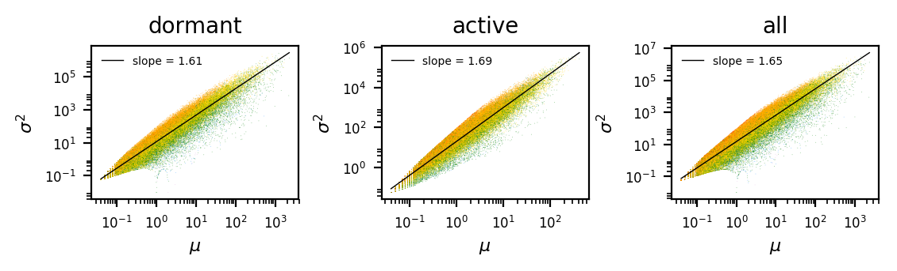
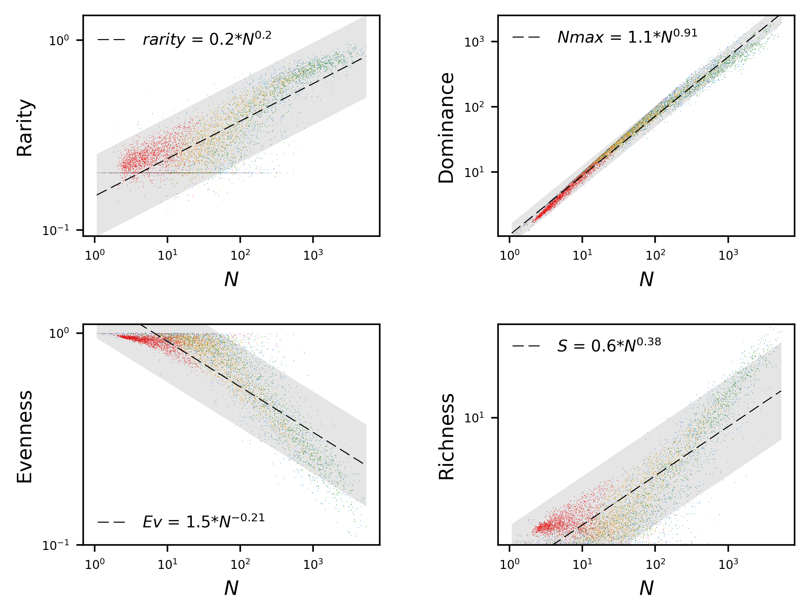
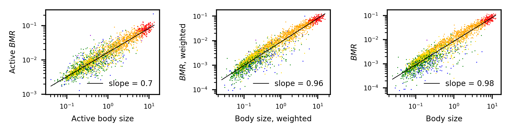
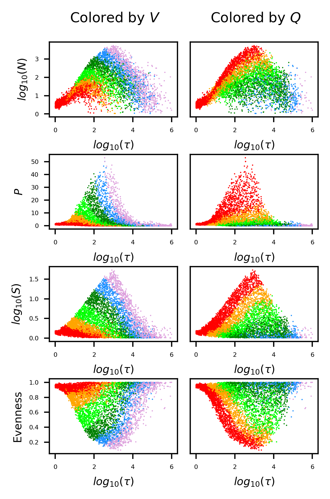
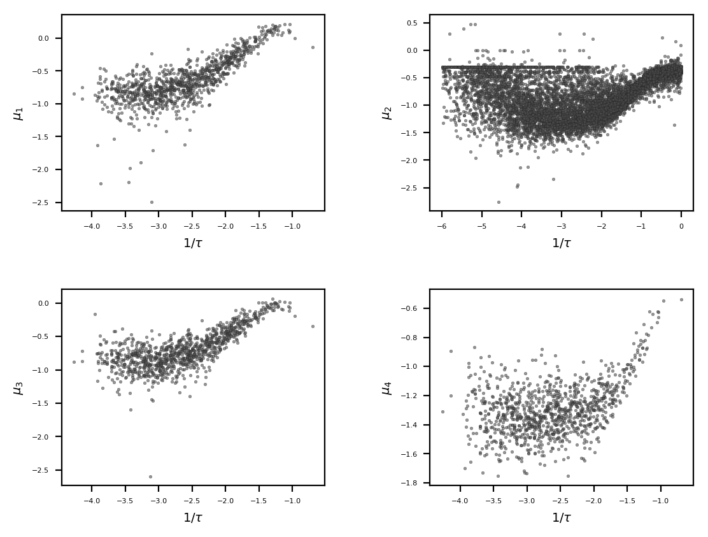
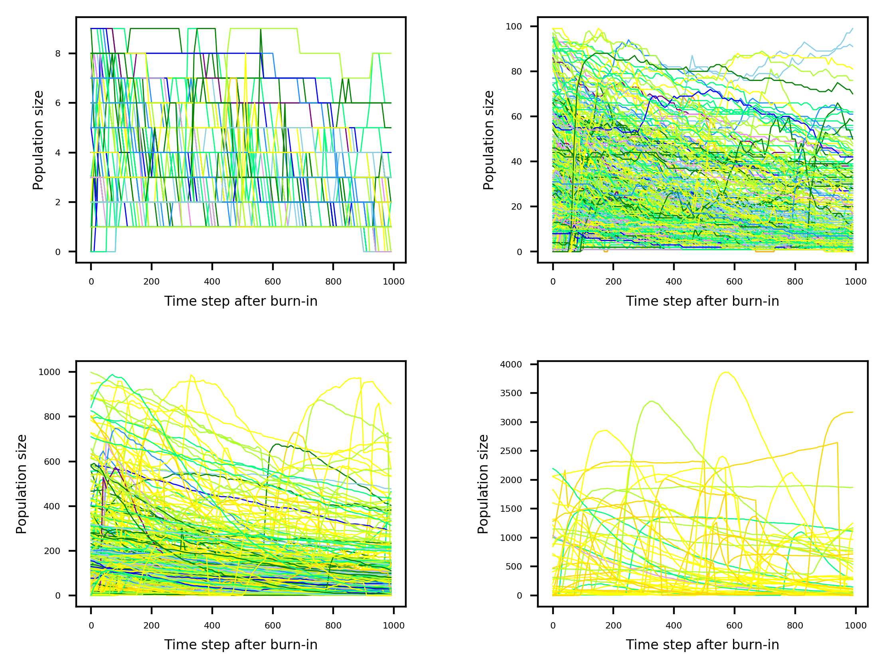
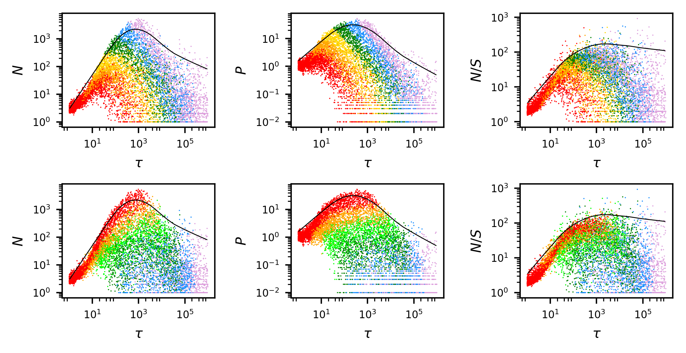

## A: Residence time = $\tau$ = $V$/$Q$

Residence time ($\tau$), the average amount of time that passively moving particles remain in a system, is often estimated from the ratio of a systems size ($V$) to its rate of flow or physical turnover ($Q$). This basic concept of residence time ($\tau$) is shared between the study of fluid dynamics, geology, and probability theory (see Schwartz 1979, Whitten 1975). Consider a perfectly mixed environment of volume ($V$) operating at a constant rate of flow ($Q$ = $v$/$t$) and containing inert particles. Because the environment is well-mixed, each particle has an equal chance of being removed in a given portion ($v$) of $V$ in a given amount of time ($t$). The ratio of $v$ to $V$ represents the fraction of the environment that is replaced per unit time ($vt$-1$V$-1 = $vV$-1$t$-1), which is known as the “dilution rate” and generally denoted as (1/$\tau$ = $Q$/$V$ = $vt$-1$V$-1). Dilution rate represents the probability ($p$) that any given particle will be lost in an amount of time equal to $t$. According to the geometric distribution, which gives the probability of $x$ successes in repeated Bernoulli trials (“yes/no” events), a particle can expect to remain in the system for an amount of time equal to 1/$p$, also known as residence time. Hence, under ideal conditions, dilution rate (1/$\tau$ = $Q$/$V$ = $p$) is the inverse of residence time ($\tau$ = $V$/$Q$ = 1/$p$).

This concept of $\tau$ is extensively applied in the operation and theory underlying bioreactors (see Smith and Waltman 1995). Consider a theoretically ideal bioreactor, a perfectly mixed environment of volume ($V$) that is not open to immigration and is operating at steady state characterized by the constant rate of flow-through of nutrient containing media and a population of constant size. The movement of all individuals in the system is entirely determined by the time ($t$) rate at which any given volume ($v$) flows through ($Q$ = $v$/$t$), as above. Finally, resource resupply is always high enough to allow maximal growth. Under these conditions, the rate of relative growth ($\mu$) equals the relative rate of removal (1/$\tau$). Hence, relative (or specific) growth rate ($\mu$) comes to equal dilution rate (1/$\tau$). However, once 1/$\tau$ exceeds the maximal proportional increase that the population can reach ($\mu_{max}$), the system loses organisms faster than they can be replaced, and a process of “washout” ensues with the eventual loss of the population.

## B: Individual-based modeling (IBM) platform

### B1. Platform description

Here, we describe our individual-based modeling (IBM) platform according to the ODD protocol (Overview, Design concepts, Details), a community standard for describing IBMs (Grimm et al. 2006).

Our IBM platform allows users to study how patterns from multiple ecological theories, disciplines, or paradigms can simultaneously emerge in the same system. These paradigms include metabolic scaling and physiological ecology, community ecology and biogeography, life history, neutral theory, resource limitation, and population ecology. The source code for this platform can be found here: https://github.com/LennonLab/residence-time.

This platform accomplishes three proximate objectives:

1. Assembles and runs IBMs from random combinations of system variables and species traits. 
2. Stores the outputs of IBMs in .csv files. 
3. Provides code for analyzing simulation data and generating figures.

### B2. Purpose
The goal of our platform is to test the predictions of a $\tau$-based theory for biodiversity and to ask whether these predictions are compatible with widely-studied patterns of biodiversity.  

### B3: Entities & their state variables
*Individual organisms* — Individuals are distinguished by collections of elements within dictionaries, i.e., data objects that hold key-value pairs. For example, the dictionary holding information on individual organisms (iDict) is structured as follows:

```{r eval=FALSE}
iDict = {ind1: sp = sp1, x  = 1.2,  sz = 81.2, q  = 2.8, st = a, age = 10, tis = 8;
	     ind2: sp = sp3, x  = 8.5,  sz = 5.2, q  = 10.4, st = a, age = 23, tis = 1,
	     …}
```

where, for example, “ind1” is the key and the variables following the colon are the values for the species ID (sp), position along the dimension of the environment against which flow occurs (x), body size (sz), amount of endogenous resources (i.e., resources within the individual that are available to fuel life processes (q), metabolic state (active or dormant) (st), and the amount of time that the individual has been in its current metabolic state (tis). Individuals undergo changes when randomly sampled from this dictionary.

*Species* — Each species is characterized by the individuals that share a common set of traits. Species information is stored in a dictionary (sDict) as key-value pairs. 

```{r eval=FALSE}
sDict = {sp1: gr = 0.8, di  = 0.5, rp  = 0.3, mt = 0.2, mf  = 0.1, ef = [0.1, …, 0.5]; 
	     sp3: gr = 0.8, di  = 0.5, rp  = 0.3, mt = 0.2, mf  = 0.1, ef = [0.2, …, 0.0];
	     …}
```

where, for example, species 1 (sp1) has a maximum intrinsic individual-based growth rate (gr) of 0.8, a maximum active dispersal rate (di) of 0.5 units per time step, a 0.3 probability of randomly resuscitating (rp) from a dormant state, a mass specific active metabolic rate (mt) of 0.2, experiences a 10% decrease in mt when entering dormancy, and has 10 resource-specific use efficiencies (ef) that sum to 1. When sampling individuals, the information about their species is gained by accessing sDict.

*Resource particles* — Our modeling simulates the movement and consumption of individual resource particles. These particles can vary over two orders of magnitude in size and belong to as many as 10 resource types. As with individual organisms and species, information about individual resource particles is stored in a dictionary (rDict).

```{r eval=FALSE}
rDict = {r1: type = 1, v  = 0.5, x  = 0.3; 
	     r2: type = 10, v  = 1.3, x  = 109.8; 
	  …}
```

In the rDict dictionary, r1 is the key for a single resource particle and the variables following the colon are the values for the resource type (type), the size of the particle (v), and the position along the dimension of the environment against which flow occurs (x).

### System level state variables
Our IBM platform runs as many randomly parameterized models as the user desires. Each model begins with random choices for the values of:

\begin{tabular}{ m{3.5cm} m{8.6cm} m{3.0cm} }
\multicolumn{3}{c}{Table S1. Each model was initiated with a set of core parameters, values for which were chosen at random.} \\
\hline \\
\multicolumn{3}{c}{Model-specific parameters} \\[1pt]

\cline{1-3} \\[1pt]
Parameter & Description & Value \\[1pt]
\hline \\[1pt]
Size ($V$) & Length of the environment & 1 - 1000 \\[3pt]

Flow rate ($Q$) & units of $V$ moved per time step & 0.001 - 1 \\[3pt]

Resource diversity ($R$) & number of inflowing resource types & 10 \\[3pt]

Maximum resource particle size & Greatest size for an inflowing resource particle & 1 - 100 \\[3pt]

Immigration rate & per capita probability of immigration per time step  & $Q$ \\[3pt]

Inflowing resource concentration & probability of a resource particle flowing in per time step & $Q$ \\[3pt] 

\hline \\[1pt]
\multicolumn{3}{c}{Species-specific traits} \\[1pt]

\cline{1-3} \\[1pt]
Species trait & Description & Value \\[1pt]
\hline \\[1pt]
Intrinsic growth rate & Proportional increase in individual size per unit time & 0.001 - 1 \\[3pt]

Active dispersal rate & Portion of a unit of $V$ traveled by individual against direction of flow per unit time & 0.001 - 1 \\[3pt]

Resuscitation rate & Probability of resuscitating per unit time & 0.001 - 1 \\[3pt]

Basal metabolic rate (BMR) & Portion of endogenous resources lost to maintenance respiration per unit time & 0.001 - 1 \\[3pt]
 
Reduction of BMR & Proportional decrease of BMR when entering dormancy  & 0.001 - 1 \\[3pt]

Resource-specific growth efficiency & Portion of a consumed resource particle, of a given resource type, assimilated into individuals' biomass  & 0.0 - 1 \\[3pt]

\hline \\[1pt]
\multicolumn{3}{c}{Individual-specific variables} \\[1pt]

\cline{1-3} \\[1pt]
Variable & Description & Value \\[1pt]
\hline \\[1pt]
Resource quota ($q$)  & Amount of endogenous resources & 0 - unconstrained \\[3pt]

Body size & Individual biomass (does not include $q$) & 0 - unconstrained \\[3pt]

$x$ & Position along $V$  & 0 - $V$ \\[3pt]

Species & Species identity of an individual & 1 - 1000 \\[3pt]

State & Metabolic state & active or dormant \\[3pt]

\hline
\end{tabular}


### B4. Process overview and scheduling

*Model assembly* — The user runs the main python program (i.e., main.py). The main program chooses random values for system-level state variables. The main program also imports modules (i.e., groups of functions) for diversity analysis and the initiation of output files.

*Randomized model parameterization* – Each IBM begins with random combinations of traits for each species in the regional pool, randomly drawn values of $V$ and $Q$ (Table 2). $V$ was randomly chosen within a range of three orders of magnitude and represented the length of a system across which flow occurred. $Q$ was also randomly chosen within a range of three orders of magnitude and represented the fraction of a single unit distance covered per time step (Table 2). These randomized starting conditions allow predictions to emerge without explicitly enforced relationships between species traits (see also Locey and Lennon 2017; Locey et al. 2017).

*Immigration and resource supply* – Each IBM began as an empty system into which resource particles flowed and individual organisms immigrated. Species identities were drawn at random from uniform distributions, as were size and identities of resource particles. Because the equilibrium density of particles in a system should not increase with $Q$ (i.e., the faster particles enter, the faster they leave) the probability of an immigrant or resource particle entering the system was multiplied by $Q$ (0.001 to 1.0).

*Overview of life history processes* — Our platform simulates individual-based processes of consumption, growth, reproduction, death, passive and active dispersal, and transitions into and out of dormancy. The ordering of life history processes is randomized at each time step to prevent scheduling bias. The rates at which individuals grew, consumed resources, and actively dispersed and whether individuals reproduced, died, or transitioned into or out of dormancy were determined by the products of independent probabilities. These probabilities were influenced by species trait values, along with the metabolic state, body size, and the endogenous resources ($q$) of individuals. Growth, active dispersal, and transitions to metabolic activity also incurred energetic costs, allowing a biologically meaningful means of simulating death while allowing environmental filtering to act individual variation in traits, size, and $q$.

*Consumption* – At each time step, randomly sampled individuals could consume a randomly encountered resource particle from any of 10 possible resource types. Because encounters with any of $R$ resource particles should be influenced by the concentration of resource particles in the environment ($D$ = $R$/$V$), the probability of consumption ($p$) was determined by a simple function that allowed $D$ to take any non-negative real number while corresponding to a probability that increased with $D$ and that equaled 0.0 in the absence of resources:

$$
\begin{aligned}
p = D/(1+D)
\end{aligned}
$$

Consumption of a resource particle increased an individual’s level of endogenous resources ($q$). The rate of consumption was determined by the individuals’ species-specific rate of consumption for the given resource type ($e$) and the size of the resource particle ($r_{0}$): 

$$
\begin{aligned}
q_{1} = q_{0} + min(r_{0}, e*r_{0}*size) 
\end{aligned}
$$

The size of the resource particle was then decreased appropriately and led resource particles of zero size to be removed from the system:

$$
\begin{aligned}
r_{1} = r_{0} - min(r_{0}, e_{i}*r_{0}*size) 
\end{aligned}
$$

*Growth* – Randomly sampled individuals grew proportionally to their $q$ and their species-specific rate of relative individual growth $\mu$, resulting in an equivalent decrease in $q$:

$$
\begin{aligned}
size_{1} = size_{0} + min(q, \mu*q) \\
q_{1} = q_{0} - min(q_{0}, \mu*q_{0}) 
\end{aligned}
$$

These simple recurrence relations produce proportional ontogenetic growth limited by $q$. They also do not allow individuals to grow in the absence of endogenous resources and enforce a conservation of mass between size, $q$, and $r$.

*Reproduction* – At each time step, randomly sampled individuals that were metabolically active could reproduce according to the product of three probabilities, each determined by a simple function that allowed values for the individual’s endogenous resources ($q$) and size to take any non-negative real number while corresponding to probabilities that increased with size and $q$. In this way, the probability of reproducing equaled 0 if $q$ or size equaled 0.

$$
\begin{aligned}
p = (q/(1+q))*(size/(1+size))
\end{aligned}
$$

In this way, greater size and greater endogenous resources contributed to whether individuals reproduced. Reproduction was clonal, as in other models of biodiversity (e.g., Hubbell 2001) and resulted in the halving of $q$ and size. Daughter individuals inherited the spatial coordinates of their mothers, were not subject to mutation, and were given an age of 0.

*Transitions between activity and dormancy* – Active individuals became dormant based on the product of probabilities determined by their age and $q$:

$$
\begin{aligned}
p = (1/(1+q))*(age/(1+age))
\end{aligned}
$$

As with reproduction, each probability was determined by a saturating function that allowed $q$, and body size to take any positive real number. In this way, a greater amount of endogenous resource decreased the probability of going dormant, while the age related probability prevented newly produced daughter individuals from going dormant because of their initially small $q$.

Dormant individuals could transition back to activity according to a probability determined by their species-specific rate of random resuscitation ($\alpha$) and individual values of $q$ and body size. 

$$
\begin{aligned}
p = (q/(1+q))*\alpha
\end{aligned}
$$

In this way, a low $q$ and small body size reduced the probability of resuscitation. Hence, dormant individuals could eventually become non-viable. Transitions to activity incurred a species-specific energetic cost proportional to $\alpha$ and their size, meaning that larger individuals incurred greater energetic costs when resuscitating.

$$
\begin{aligned}
q_{1} = q_{0} - \alpha*size 
\end{aligned}
$$

*Metabolic Maintenance and Death* – At each time step, randomly sampled individuals incurred a species-specific cost of basal metabolism ($BMR$) that was likewise, proportional to their size. If the individual was dormant, $BMR$ was reduced by a species-specific value ($\gamma$). Hence, dormant individuals incurred metabolic costs that were lower than the cost of active $BMR$, and the value of $\gamma$ represented the strength of that reduction. The cost of basal metabolism was paid through the reduction of $q$:

$$
\begin{aligned}
active:  q_{1} = q_{0} - BMR*size \\
dormant: q_{1} = q_{0} - \gamma*BMR*size
\end{aligned}
$$

Individuals were simulated as having died when they were unable to pay the cost of basal metabolism, i.e., $q$ < 0. Hence, both active and dormant individuals could die of starvation.

*Dispersal* – At each time step, individuals were passively moved according to the rate of flow ($Q$). However, randomly sampled active individuals could disperse against the direction of flow according to their species-specific dispersal rate ($\delta$). 

$$
\begin{aligned}
x_{1} = x_{0} - min(x_{0}, \delta*size) \\
q_{1} = q_{0} - min(q_{0}, \delta*size) 
\end{aligned}
$$

In this way, individuals could not disperse beyond the upstream edge of the system and also incurred an energetic cost that was proportional to the individuals’ size and the distance moved against the direction of $Q$.


### B5. Design concepts

*Basic principles* — 

Environmental filtering on species traits: Our IBM platform operates according to a basic principle of ecology, that is, the selection via the abiotic environment on species traits. Our platform assembles models from random combinations of system-level, species-level, and individual-level variables.

Energy-limited life history: Our IBM platform imposes energetic costs to growth and activity. These energetic costs are directly proportional to the values of life history traits. For example, the energetic cost of dispersal is the product of dispersal rate and dispersal distance. This intuitively means that the energetic cost of dispersal is multiplied across distance such that moving a distance of $d$ in a specific direction requires half the energy as moving a distance of 2$d$ in the same direction.

Lognormal dynamics: Multiplicative interactions of random variables underpin one of the most successful models of complex systems, i.e., the lognormal (Crow et al. 1988). The lognormal was introduced to ecologists by Preston (1962) as a description of how abundance varies among species. The lognormal has been one of the two most successful models of species abundance for macroscopic plants and animals, and was recently used to form a macroecological theory of microbial diversity (Shoemaker et al. 2017). By "multiplicative interactions" one simply means that two or more variables interact in a multiplicative way, such as the product of body size and the rate of proportional growth or the product of dispersal distance and energetic cost per unit distance. Such interactions are common in ecology and underpin most models of population growth (Putnam 1993). By "random variables" one simply means two independent variables that are either chosen at random or that change stochastically. Our platform explicitly simulates these lognormal dynamics; for example, in the simulation of stochastic proportional growth, active dispersal, and in the simulation of energetic costs.

Simultaneous emergence: A popular advantage of IBMs is the potential to study the emergence of complex patterns from individual-level interactions. Our platform allows emergence in three ways that IBMs are rarely employed. First, patterns emerge from random combinations of traits and state variables. This allows realistic trait syndromes and patterns to emerge without being explicitly enforced. Second, patterns emerge across orders of magnitude in random variation in starting conditions of a large ensemble of IBMs. These degrees of variation can be changed in 'main.py' file and in the 'immigration' function located in the 'bide.py' file. This highly unconstrained approach allows the user to explore a broad spectrum of trait combinations. Third, our platform allows for the study of simultaneous emergence, that is, the emergence of several patterns at once. In this way, our platform initiates with unrealistic ecological communities and unrealistic combinations of species traits, and then allows for ecological realism to develop over time in response to environmental conditions and according to energetic costs.
This approach allows the user of our platform to avoid one of the greatest challenges to ecological modeling, i.e., the circularity of documenting outcomes that are otherwise forced to occur by explicitly enforced relationships and arbitrarily chosen parameter values. The code made available for analysis of simulation data is intended to examine the variation and central limiting behavior of ecological patterns among thousands of IBMs.

### B6. Other design concepts of the ODD protocol

*Hypotheses* — Our platform was designed to test predictions of our residence-time theory and to show that these predictions are compatible with well-known patterns of biodiversity.

*Learning* — There is no aspect of individual-based learning in Emergence. An example of learning would be adaptation of individuals to local conditions.

*Prediction* — Individuals in Emergence do not presently have the ability to anticipate changes in environmental conditions.

*Sensing* — Individuals in our IBMs cannot currently sense the environment. That is, they cannot move towards resource particles or sense the presence of resources that might otherwise induce resuscitation from dormancy.

*Interaction* — Individuals interact through excluding each other from resources, i.e., preemption. 
There is no explicit communication and because there is presently no trophic structure, there are no trophic interactions.

*Observation* — An unlimited number of IBMs can be run to examine trends and variation in ecological patterns from the recording of 119 metrics and additional aspects of community structure. See 'Output data' below.

### B7. Output data
Our IBM platform generates three files of output data. Each IBM quantifies and writes output data for every nth time step after “burn in”, where n and the number of time steps given for the model to assemble a community (the “burn in”) can be designated by the user. The three files are:

*SimData.csv* — Each of the 119 columns of this file corresponds to a piece of data about the system that was modeled (e.g., flow rate, total abundance, species richness, species turnover, resource supply and diversity, rate of disturbance, etc.). Most analyses are conducted on the data in this file. The following is recorded for each Emergence model and stored in SimData.csv:

\begin{longtable}{| p{.32\textwidth} | p{.60\textwidth} |}
\multicolumn{2}{c}{Table S2. Output of simulation-based data from ensembles of IBMs. These data are found in SimData.csv.} \\
\hline
\textbf{Datum (column header)} & \textbf{Description} \\
\hline
\endfirsthead
\multicolumn{2}{c}%
{\tablename\ \thetable\ -- \textit{Continued from previous page}} \\
\hline
\textbf{Datum (column header)} & \textbf{Description} \\
\hline
\endhead
\hline \multicolumn{2}{r}{\textit{Continued on next page}} \\
\endfoot
\hline
\endlastfoot

sim & Unique identifier for the $n^{th}$ simulation \\[6pt]

time &  computer clock time \\[6pt]

ct & $m^{th}$ time step of the $n^{th}$ simulation \\[6pt]

immigration.rate & Probability of an individual immigrating per time step\\[6pt]

inflowing.res.dens & Number of resource particles inflowing per time step \\[6pt]

N.types & Number of resource types \\[6pt]

max.res.val & Greatest size of any inflowing resource particle\\[6pt]

max.growth.rate & Maximum intrinsic growth rate for any species \\[6pt]

max.met.maint & Maximum fraction of individual endogenous resources lost to metabolic maintanence per time step. A species-specific parameter. \\[6pt]

max.active.dispersal & Maximum amount of distance traveled by any individual againt the direction of flow. A species-specific parameter. \\[6pt]

starting.seed & Number of individuals that initially occupy the system. Default = 1. \\[6pt]

V & Length of the environment \\[6pt]

flow.rate & Units of V moved per time step \\[6pt]

total.abundance & Number of individual organisms in the system. \\[6pt]

active.total.abundance & Number of active individual organisms in the system. \\[6pt]

dormant.total.abundance & Number of dormant individual organisms in the system. \\[6pt]

ind.production & Number of individual organisms produced in the $m^{th}$ time step. \\[6pt]

resource.particles & Number of resource particles in the system. \\[6pt]

resource.concentration & Number of resource particles for every unit of V. \\[6pt]

resource.richness & Number of resource types present. \\[6pt]

species.richness & Number of species present. \\[6pt]

simpson.e & Simpson's measure of species evenness. Equitability of species abundances. \\[6pt]

avg.pop.size & Mean population size among species. \\[6pt]

pop.var & Variance in population size among species. \\[6pt]

N.max & Abundance of the most abundant species. \\[6pt]

logmod.skew & Log-modulo skewness of the frequency distribution of species abundances. A measure of species rarity. \\[6pt]

whittakers.turnover & Whittaker's measure of species turnover between two time points, quantifying the percent turnover in species membership. Does not consider species abundances. \\[6pt]

total.biomass & Mean biomass of individual organisms (i.e., size + endogenous resources). \\[6pt]

avg.per.capita.growth & Mean per capita rate of intrinsic individual growth. \\[6pt]

avg.per.capita.maint & Mean per capita rate of mass-specific active basal metabolic rate (BMR). Portion of individual endogenous resources lost per unit size, per time step. \\[6pt]

avg.per.capita.efficiency & Mean per capita variance in resource efficiency. Resource efficiencies are species-specific. \\[6pt]

avg.per.capita.active.dispersal & Mean per capita rate of active dispersal, i.e., portion of a unit of V that individuals can move against the direction of flow. Active dispersal rates are species-specific. \\[6pt]

avg.per.capita.rpf & Mean per capita probability of randomly resuscitating from a metabolically dormant state. A species-specific trait. \\[6pt]

avg.per.capita.mf & Mean per capita percent by which active BMR is decreased when individuals enter a metabolically dormant state. A species-specific trait. \\[6pt]

avg.per.capita.size & Mean per capita body size. Does not include individuals' endogenous resources. \\[6pt]

active.species.richness & Number of species in the metabolically active portion of the community. \\[6pt]

active.simpson.e & Simpson's measure of species evenness within the metabolically active portion of the community. \\[6pt]

active.avg.pop.size & Mean population size among species within the metabolically active portion of the community.  \\[6pt]

active.pop.var & Variance in population size among species within the metabolically active portion of the community. \\[6pt]

active.N.max & Abundance of the most abundant species within the metabolically active portion of the community. \\[6pt]

active.logmod.skew & Log-modulo skewness of the frequency distribution of species abundances within the metabolically active portion of the community. A measure of species rarity. \\[6pt]

active.whittakers.turnover & Whittaker's measure of species turnover between two time points, quantifying the percent turnover in species membership within the metabolically active portion of the community. Does not consider species abundances. \\[6pt]

active.total.biomass & Mean biomass of individual organisms (i.e., size + endogenous resources) within the metabolically active portion of the community. \\[6pt]

active.avg.per.capita.growth & Mean per capita rate of intrinsic individual growth within the metabolically active portion of the community. \\[6pt]

active.avg.per.capita.maint & Mean per capita rate of mass-specific active basal metabolic rate (BMR) within the metabolically active portion of the community. Portion of individual endogenous resources lost per unit size, per time step. \\[6pt]

active.avg.per.capita.efficiency & Mean per capita variance in resource efficiency within the metabolically active portion of the community. Resource efficiencies are species-specific. \\[6pt]

active.avg.per.capita.dispersal & Mean per capita rate of active dispersal within the metabolically active portion of the community, i.e., portion of a unit of V that active individuals can move against the direction of flow. \\[6pt]

active.avg.per.capita.rpf & Mean per capita probability of randomly resuscitating from a metabolically dormant state for species within the metabolically active portion of the community. A species-specific trait. \\[6pt]

active.avg.per.capita.mf & Mean per capita percent by which active BMR is decreased when individuals enter a metabolically dormant state. With respect to species within the metabolically active portion of the community. A species-specific trait. \\[6pt]

active.avg.per.capita.size & Mean per capita body size within the metabolically active portion of the community. Does not include individuals' endogenous resources. \\[6pt]

dormant.species.richness & Number of species in the dormant portion of the community. \\[6pt]

dormant.simpson.e & Simpson's measure of species evenness within the dormant portion of the community. \\[6pt]

dormant.avg.pop.size & Mean population size among species within the dormant portion of the community.  \\[6pt]

dormant.pop.var & Variance in population size among species within the dormant portion of the community. \\[6pt]

dormant.N.max & Abundance of the most abundant species within the dormant portion of the community. \\[6pt]

dormant.logmod.skew & Log-modulo skewness of the frequency distribution of species abundances within the dormant portion of the community. A measure of species rarity. \\[6pt]

dormant.whittakers.turnover & Whittaker's measure of species turnover between two time points, quantifying the percent turnover in species membership within the dormant portion of the community. Does not consider species abundances. \\[6pt]

dormant.total.biomass & Mean biomass of individual organisms (i.e., size + endogenous resources) within the dormant portion of the community. \\[6pt]

dormant.avg.per.capita.growth & Mean per capita rate of intrinsic individual growth within the dormant portion of the community. \\[6pt]

dormant.avg.per.capita.maint & Mean per capita rate of mass-specific active basal metabolic rate (BMR) within the dormant portion of the community. Portion of individual endogenous resources lost per unit size, per time step. \\[6pt]

dormant.avg.per.capita.efficiency & Mean per capita variance in resource efficiency within the dormant portion of the community. Resource efficiencies are species-specific. \\[6pt]

dormant.avg.per.capita.dispersal & Mean per capita rate of active dispersal within the dormant portion of the community, i.e., portion of a unit of V that active individuals can move against the direction of flow. \\[6pt]

dormant.avg.per.capita.rpf & Mean per capita probability of randomly resuscitating from a metabolically dormant state for species within the dormant portion of the community. A species-specific trait. \\[6pt]

dormant.avg.per.capita.mf & Mean per capita percent by which active BMR is decreased when individuals enter a metabolically dormant state. With respect to species within the dormant portion of the community. A species-specific trait. \\[6pt]

dormant.avg.per.capita.size & Mean per capita body size within the dormant portion of the community. Does not include individuals' endogenous resources. \\[6pt]

percent.dormant & Percent of individuals in the model that are in a metabolically inactive state of zero growth, zero active dispersal, zero reproduction, and decreased metabolic rate. \\[6pt]

inflowing.res.rich & Number of resource types that can flow into the $n^{th}$ model. \\[6pt]

total.res & Sum of all resource particle sizes in the model. \\[6pt]


efficiency & Mean variance in resource efficiency among species. Resource efficiencies are species-specific. \\[6pt]

growth & Mean rate of intrinsic individual growth among species. \\[6pt]

maint & Mean rate of mass-specific active basal metabolic rate (BMR) among species. The portion of endogenous resources lost per unit mass of an active individual, per unit time. \\[6pt]

mf & Mean percent by which BMR is decreased when individuals transition to a dormant state. \\[6pt]

rpf & Mean species-specific probability of dormant individuals randomly resuscitating to a metabolically active state. \\[6pt]

dispersal & Mean fraction of a unit of V that individuals can move against the direction of flow. \\[6pt]

active.efficiency & Mean variance in resource efficiency among species within the metabolically active portion of the community. Resource efficiencies are species-specific. \\[6pt]

active.growth & Mean rate of intrinsic individual growth among species within the metabolically active portion of the community. \\[6pt]

active.maint & Mean rate of mass-specific active basal metabolic rate (BMR) among species within the metabolically active portion of the community. The portion of endogenous resources lost per unit mass of an active individual, per unit time. \\[6pt]

active.mf & Mean percent by which BMR is decreased when individuals within the metabolically active portion of the community transition to a dormant state. \\[6pt]

active.rpf & Mean species-specific probability of dormant individuals randomly resuscitating to a metabolically active state. Here, with respect to individuals within the metabolically active portion of the community. \\[6pt]

active.dispersal & Mean fraction of a unit of V that active individuals can move against the direction of flow. Here, with respect to individuals within the metabolically active portion of the community. \\[6pt]

dormant.efficiency & Mean variance in resource efficiency among species within the dormant portion of the community. Resource efficiencies are species-specific. \\[6pt]

dormant.growth & Mean rate of intrinsic individual growth among species within the dormant portion of the community. \\

dormant.mf & Mean percent by which BMR is decreased when active individuals transition to a dormant state. Here, with respect to individuals within the dormant portion of the community. \\[6pt]

dormant.maint & Mean rate of mass-specific basal metabolic rate (BMR) among species within the dormant portion of the community. For each species, active BMR is decreased by a species-specific factor. The portion of endogenous resources lost per unit mass of a dormant individual, per unit time. \\[6pt]

dormant.rpf & Mean species-specific probability of dormant individuals randomly resuscitating to a metabolically active state. Here, with respect to individuals within the dormant portion of the community. \\[6pt]

dormant.dispersal & Mean fraction of a unit of V that active individuals can move against the direction of flow. Here, with respect to individuals within the dormant portion of the community. \\[6pt]

\end{longtable}


*SAR.csv* -- A file holding results for species-area relationships (SARs) from Emergence models.
SARs quantify the rate at which species are encountered with increasing area of a sample, study, landscape, etc. The SAR is among the most intensively and long-studied patterns in ecology and is one of two patterns commonly predicted by biodiversity theories (Lomolino 2000, Hubbell 2001, Harte 2011). The SAR file holds z-values for two types of SARs: SARs based on a nested design and SARs based on the random accumulation of subplots (or quadrats).

*RADs.csv* -- A file holding rank-abundance distributions (RADs) from Emergence models.
Also referred to as species-abundance distributions (SADs), rank-abundance curves (RACs), and Whittaker plots, RADs are vectors of the abundances of species in a community.
Along with the SAR, RADs are one of the most intensively studied and commonly predicted ecological patterns (Hubbell 2001, McGill et al. 2007, Harte 2011).

### B7. Metrics

*Species evenness* -- Species evenness was calculated using Simpson's evenness metric, an inverse analog of the sample variance.

*Species rarity* -- Rarity was calculated as log-modulo skewness, a transformation of the skewness of the species abundance frequency distribution, as in Locey and Lennon (2017).

*Species richness* -- Richness was quantified as the total number of species, as in Locey and Lennon (2017).

*Species dominance* -- Dominance was quantified as the abundance of the most abundant species, as in Locey and Lennon (2017).

*Species turnover* -- Turnover was quantified using Whittaker's measure, which quantifies the proportional turnover of species between time points.

*Resource specialization* -- Resource specialization was quantified in three ways using resource use efficiencies. These efficiencies can range between 0 and 1. The first of these measures was the variance in efficiencies, to include those that species could not use. The second measure quantified the variance in efficiencies but only included those that species could actually use. The third measure reflected the inverse of the number of resources a species could use (x): 1/(1+x), such that higher values reflect higher specialization.


### B8. General ecological patterns generated by Emergence

Emergence source code includes python scripts to analyze the following ecological patterns.

*Species abundance distribution (SAD)* -- The SAD is the vector of species abundance in an ecological community and is one of ecology's fundamental patterns of commonness and rarity. SAD's almost universally reflect that few species in ecological communities are highly abundant while most species are relatively rare (McGill et al. 2007). The SAD is predicted by more than 20 ecological models, the two most successful of which are the Poisson-lognormal and the log-series distributions (White et al. 2012, Baldridge et al. 2015, Shoemaker et al. 2017).

*Species-area relationship (SAR)* -- Also referred to as the species-area curve, the SAR describes the rate at which increasing numbers of species are observed with increasing area, and is also one of ecology's most intensively studied patterns (Rosenzweig 1995, Lomolino 2000). There four basic types of SARs pertaining to types of biotas and four general sampling schemes (Rosensweig 1995). Here, we consider SARs for single biotas (i.e., not crossing ecoregions or biogeographical provinces) and generate them using two sampling schemes (i.e., nested design, random aggregation of subplots).

*Metabolic scaling* -- The scaling of basal metabolic rate ($B$) with body size ($M$) is one of the strongest patterns of ecology (Brown et al. 2004). Taking the form $B$ $\propto$ $B_{0}M^{z}$, the scaling exponent $z$ is most often observed to approach 3/4. However, this scaling exponent has long been argued to be closer to 2/3 and in some cases can approach 1.0 (Glazier 2006). The metabolic theory of ecology (MTE) predicts that $z$ = 3/4 and, from this, predicts several other relationships that scale to quarter powers of body size. These include a -1/4 scaling of mass-specific metabolic rate and a -3/4 scaling of population density.

*Diversity-abundance scaling relationships* -- Aspects of species-level diversity have been shown to scale with the total abundance  ($N$) of individuals in a sample at rates that are often similar for microorganisms and macroscopic plants and animals (Locey and Lennon 2016). These aspects include: 

Richness ($S$): Number of species in a community.
Rarity: The concentration of species at low abundances can be quantified as the a measure of the skewness of the histogram of species abundances.
Absolute dominance ($N_{max}$): The greatest species abundance.
Evenness ($E$): Similarity or equitability of abundance among species. Often quantified as an inverse reflection of the sample variance.

*Taylor's Law* -- The variance ($\sigma^{2}$) in population abundance often scales with the average population abundance ($N/S$) across space and through time at a rate between 1 and 2, i.e., $\sigma^{2}$ = ($N/S$)$^{1 < z < 2}$. Named after Taylor (1961), Taylor's Law is observed in many ecological and non-ecological systems.


\newpage  
## C: Supplemental results  

### Species abundance distribution (SAD)

**Figure S1.** Despite being initialized with random samples from unrealistically structured regional species pools (i.e., equal distributions of abundance among species) the resulting SADs of 10,000 Emergence models are well-fit by the Poisson-lognormal distribution and the log-series distribution. Kernel density curves show the distribution of r-square values for the Poisson lognormal (red) and the form of the log-series (blue) predicted by the Maximum Entropy Theory of Ecology (METE). These r-square values reveal the percent variation in Emergence SADs explained by the SAD models. As commonly observed in ecological communities, both models often explain >75% variation in abundance among species.

\  

### Taylor's Law  

**Figure S2.** Emergence reproduced strong scaling of variance in population size with average population size; a ubiquitous ecological observation. The scaling exponents (~3) were higher than typically observed for Taylor's Law, where the slope typically ranges between 1 and 2. Each data point represent the mean for a single model.

\  


\newpage
 
 
### Diversity-abundance relationships  

**Figure S3.** 10,000 Emergence models reproduced diversity-abundance scaling relationships of Locey and Lennon (2016) with relatively high accuracy. Each data point represent the mean for a single model.

\  


### Metabolic scaling  

**Figure S4.** 10,000 Emergence closely reproduced the 3/4 power scaling of basal metabolic rate to body size for metabolically active individuals. This same scaling does not hold for metabolically dormant individuals, as might be expected. Each data point represent the mean for a single model.

\  

\newpage

### Opposing influence of flow rate and system size

**Figure S5.** According the definition of residence time as the ratio of a system's size $V$ to its rate of flow $Q$, $V$ and $Q$ have opposing influences on the value of residence time. Hence, $V$ and $Q$ should have opposing influences on variables that respond to residence time. Each data point represent the mean for a single model.

\  


### No relationship between specific growth rate and dilution rate

**Figure S6.** In idealized systems such as experimental chemostats, diluation rate ($1/\tau$) approximates specific growth rate ($\mu$), that is, the proportional rate of population growth. However, this expected relationship could be expected to fail in systems that lack stable-state dynamics and that are characterized by stochastic population and community dynamics, as in our IBMs. Each data point represent the mean for a single model.

\  


### Stochastic population dynamics
**Figure S7.** Time series of populations from different IBMs. These populations maintained non-zero abundances for the duration of their IBM and are clearly characterized by non-stable state dynamics, stochastic changes, and highly fluctuating population sizes. 

\  


### Influence of residence time on average species abundance.

**Figure S8.** Though not one of our primary predictions, residence time had a similar hump-shaped influence on average species abundance ($N$/$S$) as it had on total community abundance ($N$) and productivity ($P$).

\  


## References

